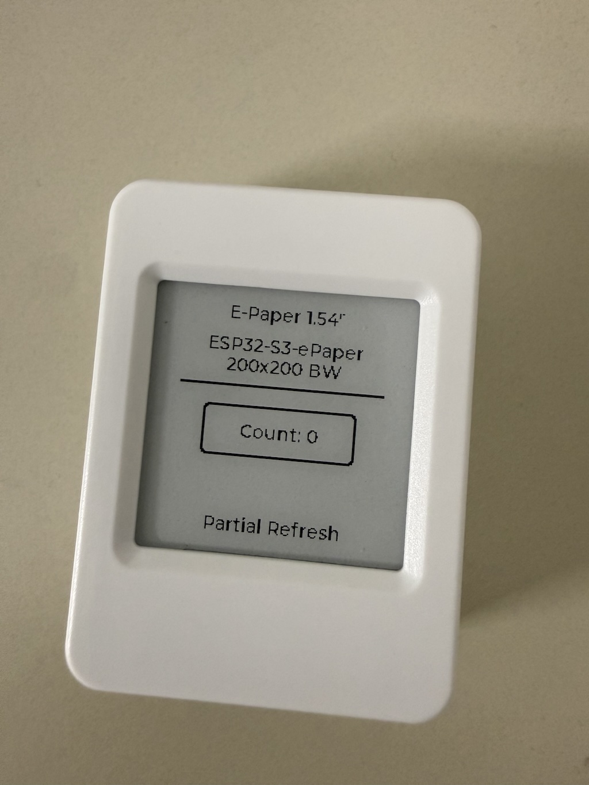
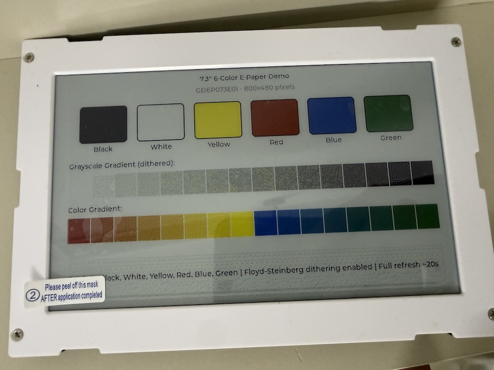

# ESP E-Paper Component

[](https://components.espressif.com/components/tuanpmt/esp_epaper)

A flexible e-paper display driver component for ESP-IDF with LVGL 9 integration. Designed for IoT devices, electronic shelf labels, photo frames, and low-power display applications.

## Supported Boards

<table>
<tr>
<td width="50%">

<br/>
<b>ESP32-S3-ePaper-1.54</b><br/>
200×200 Black/White with partial refresh<br/>
<a href="https://www.waveshare.com/wiki/ESP32-S3-ePaper-1.54">Waveshare Wiki</a>
</td>
<td width="50%">

<br/>
<b>ESP32-S3-PhotoPainter</b><br/>
800×480 6-Color with Floyd-Steinberg dithering<br/>
<a href="https://www.waveshare.com/wiki/ESP32-S3-PhotoPainter">Waveshare Wiki</a>
</td>
</tr>
</table>

## Key Features

### Multi-Color Panel Support
- **Black/White (1-bit)**: Classic e-paper with fastest refresh
- **3-Color (BWR/BWY)**: Black, White, Red or Yellow
- **6-Color**: Black, White, Yellow, Red, Blue, Green - ideal for photo frames

### Floyd-Steinberg Dithering
Advanced error-diffusion dithering algorithm for photo-quality images:
- Smooth gradients using only available colors
- Automatic RGB565 to panel palette conversion
- Pure color detection to avoid noise on solid colors
- PSRAM support for large displays (800×480)

### LVGL 9 Partial Refresh
Smart partial refresh for BW panels:
- Base image tracking for differential updates
- Automatic mode switching (partial ↔ full)
- Configurable ghosting prevention threshold

### Runtime Configuration
- GPIO pin assignments (BUSY, RST, DC, CS, SCK, MOSI)
- SPI host and clock speed
- Panel type, dimensions, rotation

### Panel Abstraction Layer
- Vtable interface for easy panel additions
- Pre-built presets for popular boards
- Shared SPI and framebuffer management

### Memory Efficient
- Automatic PSRAM allocation for large buffers
- Chunked SPI transfers for DMA compatibility
- Optional dithering buffer

## Supported Panels

### Specific Panels (Custom LUT/Features)

| Panel | Size | Resolution | Colors | Partial Refresh |
|-------|------|------------|--------|-----------------|
| GDEY0154D67 | 1.54" | 200×200 | BW | ✓ (custom LUT) |
| GDEP073E01 | 7.3" | 800×480 | 6-Color | ✗ |

### Generic SSD16xx Panels (Same Driver)

Adding new BW panels requires only **~5 lines of code** - see [ADDING_PANELS.md](ADDING_PANELS.md).

| Panel Type | Size | Resolution | Compatible Models |
|------------|------|------------|-------------------|
| SSD16XX_154 | 1.54" | 200×200 | GDEM0154I61, etc. |
| SSD16XX_213 | 2.13" | 122×250 | GDEY0213B74, GDEM0213I61 |
| SSD16XX_266 | 2.66" | 152×296 | GDEY0266T90, GDEY0266T90H |
| SSD16XX_270 | 2.7" | 176×264 | GDEY027T91, GDEM027Q72 |
| SSD16XX_290 | 2.9" | 128×296 | GDEY029T94, GDEY029T71H |
| SSD16XX_370 | 3.7" | 280×480 | GDEY037T03 |
| SSD16XX_420 | 4.2" | 400×300 | GDEY042T81, GDEQ0426T82 |

## Installation

### Using ESP-IDF Component Registry (Recommended)

Add to your project's `idf_component.yml`:

```yaml
dependencies:
  tuanpmt/esp_epaper: "^1.0.2"
  lvgl/lvgl: "^9.4.0"
```

Then run:
```bash
idf.py reconfigure
```

### Manual Installation

Clone or copy this repository to your project's `components` folder:

```bash
cd your_project/components
git clone https://github.com/tuanpmt/esp_epaper.git
```

## Quick Start

### Basic Usage

```c
#include "epaper.h"
#include "epaper_lvgl.h"
#include "lvgl.h"

void app_main(void)
{
    lv_init();
    
    // Use preset configuration for ESP32-S3-ePaper-1.54
    epd_config_t cfg = EPD_CONFIG_ESP32S3_154();
    
    // Initialize e-paper
    epd_handle_t epd;
    ESP_ERROR_CHECK(epd_init(&cfg, &epd));
    
    // Initialize LVGL display
    epd_lvgl_config_t lvgl_cfg = EPD_LVGL_CONFIG_DEFAULT();
    lvgl_cfg.epd = epd;
    lv_display_t *disp = epd_lvgl_init(&lvgl_cfg);
    
    // Create UI with LVGL...
    lv_obj_t *label = lv_label_create(lv_screen_active());
    lv_label_set_text(label, "Hello E-Paper!");
    lv_obj_center(label);
    
    // Refresh display
    epd_lvgl_refresh(disp);
}
```

### 6-Color Panel with Dithering (PhotoPainter)

```c
epd_config_t cfg = EPD_CONFIG_73_6COLOR();
epd_handle_t epd;
epd_init(&cfg, &epd);

epd_lvgl_config_t lvgl_cfg = EPD_LVGL_CONFIG_DEFAULT();
lvgl_cfg.epd = epd;
lvgl_cfg.update_mode = EPD_UPDATE_FULL;
lvgl_cfg.dither_mode = EPD_DITHER_FLOYD_STEINBERG;  // Enable dithering

lv_display_t *disp = epd_lvgl_init(&lvgl_cfg);
```

## Configuration Presets

```c
// Waveshare ESP32-S3-ePaper-1.54 (1.54" BW)
epd_config_t cfg = EPD_CONFIG_ESP32S3_154();

// Waveshare ESP32-S3-PhotoPainter (7.3" 6-Color)
epd_config_t cfg = EPD_CONFIG_73_6COLOR();
```

### Custom Configuration

```c
epd_config_t cfg = {
    .pins = {
        .busy = GPIO_NUM_8,
        .rst = GPIO_NUM_9,
        .dc = GPIO_NUM_10,
        .cs = GPIO_NUM_11,
        .sck = GPIO_NUM_12,
        .mosi = GPIO_NUM_13,
    },
    .spi = {
        .host = SPI2_HOST,
        .speed_hz = 10000000,  // 10MHz
    },
    .panel = {
        .type = EPD_PANEL_GDEY0154D67,
        .width = 0,   // 0 = use panel default
        .height = 0,
    },
};
```

## Update Modes

| Mode | Description | Use Case |
|------|-------------|----------|
| `EPD_UPDATE_FULL` | Full refresh with flashing | Initial display, clearing ghosting |
| `EPD_UPDATE_PARTIAL` | Fast partial update | UI updates, counters |
| `EPD_UPDATE_FAST` | Fast mode (panel dependent) | Animations |

## Floyd-Steinberg Dithering

The component implements Floyd-Steinberg error-diffusion dithering, which produces high-quality images on limited color e-paper displays by distributing quantization errors to neighboring pixels.

### How It Works

1. **RGB565 → RGB888 Conversion**: LVGL buffer is converted with proper bit expansion (no precision loss)
2. **Palette Matching**: Each pixel is matched to the nearest e-paper color
3. **Error Diffusion**: Quantization error is distributed to neighbors (7/16 right, 3/16 bottom-left, 5/16 bottom, 1/16 bottom-right)
4. **Pure Color Detection**: Solid colors (exact palette matches) skip dithering to avoid noise

### Usage

```c
epd_lvgl_config_t lvgl_cfg = EPD_LVGL_CONFIG_DEFAULT();
lvgl_cfg.epd = epd;
lvgl_cfg.dither_mode = EPD_DITHER_FLOYD_STEINBERG;  // Enable dithering

lv_display_t *disp = epd_lvgl_init(&lvgl_cfg);
```

### 6-Color Palette

| Color | RGB Value | E-Paper Code |
|-------|-----------|--------------|
| Black | (0, 0, 0) | 0x00 |
| White | (255, 255, 255) | 0x01 |
| Yellow | (255, 255, 0) | 0x02 |
| Red | (255, 0, 0) | 0x03 |
| Blue | (0, 0, 255) | 0x05 |
| Green | (0, 255, 0) | 0x06 |

### Memory Requirements

Dithering requires an RGB888 buffer stored in PSRAM:

| Display | RGB Buffer Size |
|---------|----------------|
| 200×200 | 120 KB |
| 800×480 | 1.15 MB |

The buffer is automatically allocated from PSRAM when available.

## Partial Refresh

BW panels support partial refresh for fast updates without full-screen flashing.

### How It Works

1. **Base Image**: First update writes to both current and previous RAM
2. **Partial Updates**: Only changed pixels are updated using differential waveform
3. **Ghosting Prevention**: Automatic full refresh after configurable number of partial updates

### Usage

```c
epd_lvgl_config_t lvgl_cfg = EPD_LVGL_CONFIG_DEFAULT();
lvgl_cfg.epd = epd;
lvgl_cfg.update_mode = EPD_UPDATE_PARTIAL;
lvgl_cfg.use_partial_refresh = true;
lvgl_cfg.partial_threshold = 5;  // Full refresh every 5 partial updates

lv_display_t *disp = epd_lvgl_init(&lvgl_cfg);

// First refresh sets base image
epd_lvgl_refresh(disp);

// Subsequent refreshes use partial mode
lv_label_set_text(label, "Count: 1");
epd_lvgl_refresh(disp);  // Fast partial update

// Force full refresh when needed
epd_lvgl_force_full_refresh(disp);
epd_lvgl_refresh(disp);  // Full refresh
```

**Note**: 6-color panels (like GDEP073E01) do not support partial refresh due to the complex multi-color waveform.

## Examples

See the `examples/` folder for complete examples:

| Example | Board | Description |
|---------|-------|-------------|
| [esp32s3_epaper_154](examples/esp32s3_epaper_154) | ESP32-S3-ePaper-1.54 | 1.54" BW with partial refresh |
| [esp32s3_photopainter](examples/esp32s3_photopainter) | ESP32-S3-PhotoPainter | 7.3" 6-Color with dithering |

### Building Examples

```bash
cd examples/esp32s3_epaper_154
idf.py set-target esp32s3
idf.py build
idf.py -p PORT flash monitor
```

## API Reference

### Core Functions

```c
esp_err_t epd_init(const epd_config_t *config, epd_handle_t *handle);
esp_err_t epd_deinit(epd_handle_t handle);
esp_err_t epd_get_info(epd_handle_t handle, epd_panel_info_t *info);
uint8_t* epd_get_framebuffer(epd_handle_t handle);
esp_err_t epd_update(epd_handle_t handle, const uint8_t *data, epd_update_mode_t mode);
esp_err_t epd_fill(epd_handle_t handle, uint8_t color);
esp_err_t epd_sleep(epd_handle_t handle);
esp_err_t epd_wake(epd_handle_t handle);
```

### LVGL Functions

```c
lv_display_t* epd_lvgl_init(const epd_lvgl_config_t *config);
void epd_lvgl_deinit(lv_display_t *disp);
void epd_lvgl_refresh(lv_display_t *disp);
void epd_lvgl_force_full_refresh(lv_display_t *disp);
```

## Adding New Panels

See [ADDING_PANELS.md](ADDING_PANELS.md) for detailed instructions on adding support for new e-paper panels.

## Memory Requirements

| Panel | Resolution | Framebuffer | RGB Buffer (dithering) |
|-------|------------|-------------|------------------------|
| 1.54" BW | 200×200 | 5 KB | 120 KB |
| 2.13" BW | 122×250 | 3.8 KB | 92 KB |
| 2.66" BW | 152×296 | 5.6 KB | 135 KB |
| 2.7" BW | 176×264 | 5.8 KB | 139 KB |
| 2.9" BW | 128×296 | 4.7 KB | 114 KB |
| 3.7" BW | 280×480 | 16.8 KB | 403 KB |
| 4.2" BW | 400×300 | 15 KB | 360 KB |
| 7.3" 6-Color | 800×480 | 192 KB | 1.15 MB |

**Note**: Large buffers (>32KB) are automatically allocated from PSRAM when available.

## License

MIT License - See [LICENSE](LICENSE)

## Author

- **tuanpmt** - [GitHub](https://github.com/tuanpmt)
